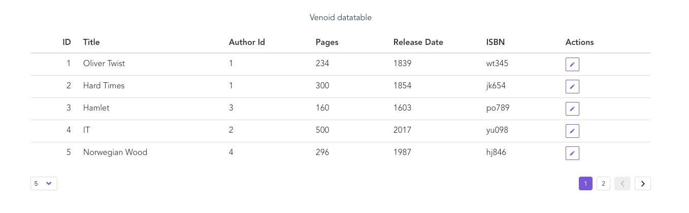

# Venoid Admin Datatable Component

Datatable component for your administration provides you good options how to load and render your data in a simple table.



## Props
| Prop         | Type    | Default   |   |
|---------------|---------|-----------|---|
| table-columns | Array   | undefined | Array of objects with this options: ```{type: 'id'|'number'|'string', label: String, field: Function(rowData), width: String}```  |
| table-data    | Array   | undefined | Array with your data |
| is-loading    | Boolean | false     | When true loading animation appears |

## Demo
To see demo run a project:

1. Install npm dependencies
2. Run with `npm run serve` / `yarn serve`
